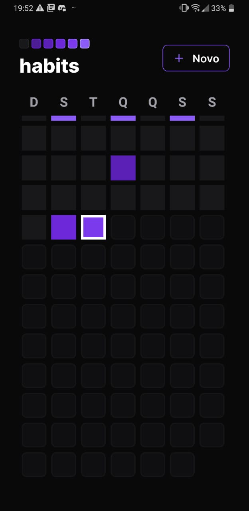
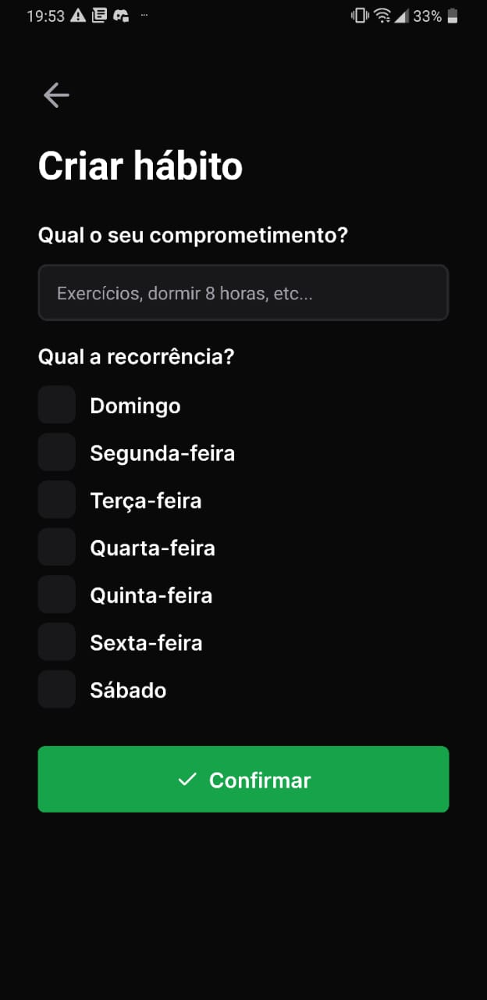
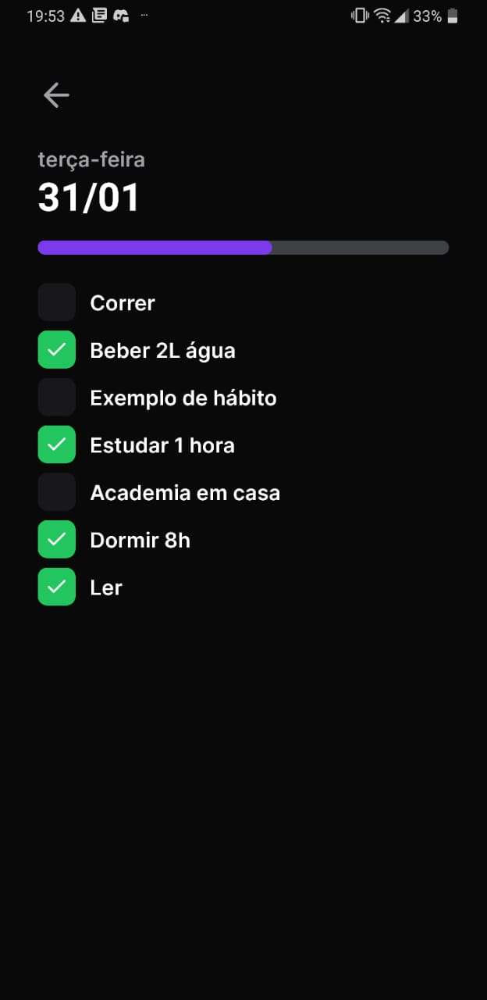
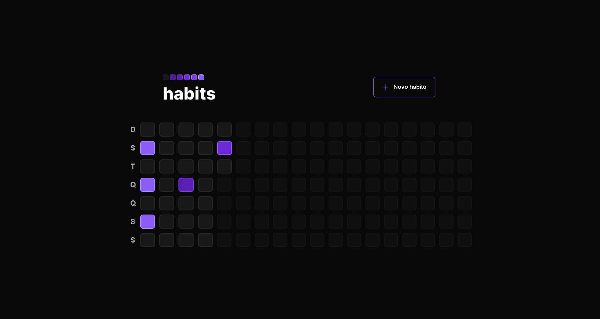
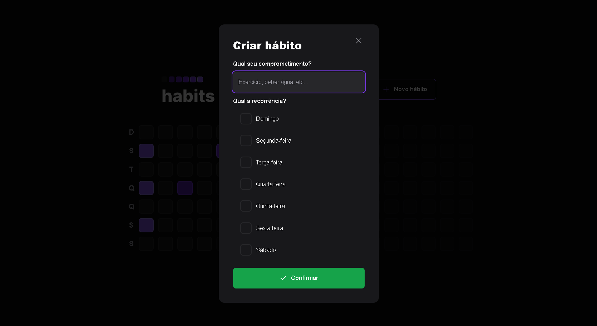
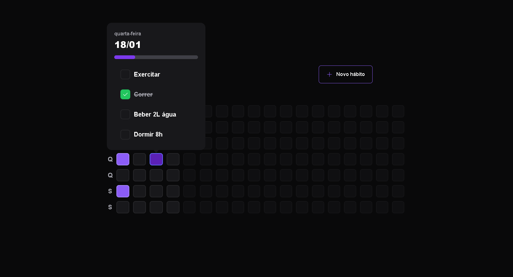

<h1 align="center">
    
</h1>

<h4 align="center"> 
	🚧 Projeto em fase de finalização 🚧
</h4>

## 💻 Descrição do projeto

Habits é um aplicativo de registro e controle de hábitos no qual o usuário é capaz de registrar novos hábitos, concluí-los no seu dia atual e visualizar posteriormente seus hábitos registrados que foram completados ou não, mantendo um controle visual do seu progresso.

Projeto desenvolvido durante a NLW - Setup | Trilha Ignite oferecido pela Rocketseat. O NLW é uma experiência online com muito conteúdo prático, desafios e hacks onde o conteúdo fica disponível durante uma semana.

## 🎨 Layout

O layout da aplicação está disponível no Figma:

<a href="https://www.figma.com/file/2RTFZFFEkVEHGmgFD7U5lz/Habits-(i)-(Community)?node-id=6%3A343&t=K9XrO2Rw9k3tct2z-1">
  
</a>


### Mobile
 
<p align="center">
  

  
    
  
</p>

### Web

<p align="center">
  

  
 
  
</p>


## 🛠 Tecnologias


As seguintes ferramentas foram usadas na construção do projeto:

- [Expo][expo]
- [Node.js][nodejs]
- [React][reactjs]
- [React Native][rn]
- [TypeScript][typescript]

## 🚀 Como executar o projeto

Podemos considerar este projeto como sendo divido em três partes:

1. Back End (pasta server) 
2. Front End (pasta web)
3. Mobile (pasta mobile)

💡Tanto o Front End quanto o Mobile precisam que o Back End esteja sendo executado para funcionar.

### Pré-requisitos

Antes de começar, você vai precisar ter instalado em sua máquina as seguintes ferramentas:
[Git](https://git-scm.com), [Node.js][nodejs]. 

Também precisará do aplicativo [Expo](expo) instalado em seu celular.

Além disto é bom ter um editor para trabalhar com o código como [VSCode][vscode]

### 🎲 Rodando o Back End (servidor)

```bash
# Clone este repositório
$ git clone https://github.com/RebecaBertolini/Habits

# Acesse a pasta do projeto no terminal/cmd

# Vá para a pasta server
$ cd server

# Instale as dependências
$ npm install

# Execute a aplicação
$ npm run dev

# O servidor inciará na porta:3333 - acesse http://localhost:3333 
```
### 🧭 Rodando a aplicação web (Front End)

```bash
# Clone este repositório
$ git clone https://github.com/RebecaBertolini/Habits

# Acesse a pasta do projeto no seu terminal

# Vá para a pasta da aplicação Front End
$ cd web

# Instale as dependências
$ npm install

# Execute a aplicação
$ npm run dev

# Acesse o link disponibilizado para visualizar
```
### 📱Rodando a aplicação mobile 

```bash
# Clone este repositório
$ git clone https://github.com/RebecaBertolini/Habits

# Acesse a pasta do projeto no seu terminal

# Vá para a pasta da aplicação Mobile
$ cd mobile

# Instale as dependências
$ npm install

# Execute a aplicação
$ npx expo start

# Acesse o aplicativo da Expo e scaneie o QR Code para visualizar
```

## 📝 Licença

Este projeto esta sobe a licença MIT.

Feito com ❤️ por Rebeca Bertolini 👋🏽 [Entre em contato!](https://www.linkedin.com/in/rebeca-bertolini-spósito-544048200/)

[nodejs]: https://nodejs.org/
[typescript]: https://www.typescriptlang.org/
[expo]: https://expo.io/
[reactjs]: https://reactjs.org
[rn]: https://facebook.github.io/react-native/
[yarn]: https://yarnpkg.com/
[vscode]: https://code.visualstudio.com/
[vceditconfig]: https://marketplace.visualstudio.com/items?itemName=EditorConfig.EditorConfig
[license]: https://opensource.org/licenses/MIT
[vceslint]: https://marketplace.visualstudio.com/items?itemName=dbaeumer.vscode-eslint
[prettier]: https://marketplace.visualstudio.com/items?itemName=esbenp.prettier-vscode
[rs]: https://rocketseat.com.br

